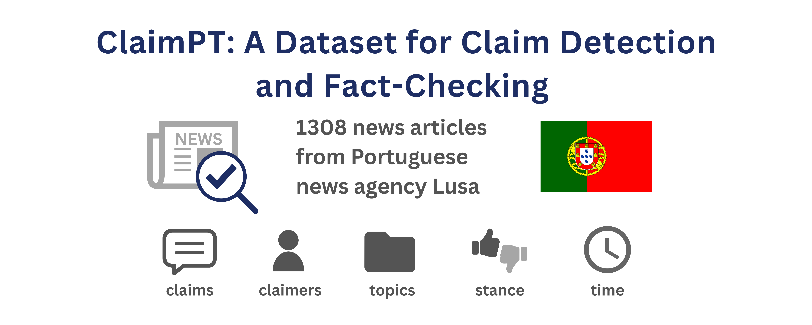

##  Overview
We introduce **ClaimPT**, a dataset of European Portuguese news articles annotated for **factual claims**, comprising **1,308 articles** and **6,875 individual annotations**. Unlike most existing resources based on social media or parliamentary transcripts, ClaimPT focuses on journalistic content, collected through a partnership with **LUSA, the Portuguese News Agency**. To ensure annotation quality, two trained annotators labeled each article, with a curator validating all annotations according to a newly proposed scheme. We also provide **baseline models for claim detection**, establishing initial benchmarks and enabling future NLP and IR applications. By releasing ClaimPT, we aim to advance research on low-resource fact-checking and enhance understanding of misinformation in news media.


## Repository Structure
``` 
├── dataset_sample/
│ ├── annotations.jsonl
│ ├── annotations.pretty.json
│ ├── news_articles/
│ │ └── *.txt
│
├── ClaimPT_Annotation_Guidelines.pdf
│
├── generative_baselines/ 
│ ├── generative_baseline.ipynb
├── bert_baselines/ 
│ ├── bert-finetune.ipynb
| ├── evaluate.py
├── LICENSE
└── README.md

```
---


## Corpus Statistics

| **Category**                      | **Property**                                                   | **Description**                    |
| --------------------------------- | -------------------------------------------------------------- | ---------------------------------- |
| 🗂️ **Corpus Overview**           | **Total Documents**                                            | 1,308                              |
|                                   | **Average Document Length**                                    | 542.8 words                        |
|                                   | **Annotated Documents (with at least one Claim or Non-Claim)** | 1,090                              |
|                                   | **Documents with Both Claim and Non-Claim**                    | 273 (≈ 25% of annotated documents) |
|                                   | **Documents containing only Non-Claim annotations**            | 817 (≈ 75% of annotated documents) |
| ✍️ **Annotation Counts**          | **Claim Annotations**                                          | 463                                |
|                                   | **Non-Claim Annotations**                                      | 4,393                              |
| 👤 **Claimer Entities**           | **Total Claimer Entities**                                     | 670                                |
|                                   | – Person                                                       | 563                                |
|                                   | – Organization                                                 | 66                                 |
|                                   | – Other Types                                                  | 41                                 |
| ⚖️ **Stance Annotations**         | **Total Stance Annotations**                                   | 463                                |
|                                   | – Affirm                                                       | 446                                |
|                                   | – Refute                                                       | 17                                 |
| 💬 **Claim Structure**            | **Claim Spans**                                                | 523                                |
|                                   | **Claim Objects**                                              | 551                                |
| 📰 **Document-Level Annotations** | **News Article Topics**                                        | 1,308 (1 per document)             |
|                                   | **Publication Times**                                          | 1,308 (1 per document)             |

---


## Data Format

The **ClaimPT** dataset is provided in **JSONL** format, where each line corresponds to an annotated span.  

| Field | Description |
|--------|-------------|
| `document` | News article filename |
| `publication_time` | Date of the news publication |
| `claim` | Boolean indicating whether the annotation is a claim (`true`) or non-claim (`false`) |
| `begin_character` | Begin character offset of the annotated text span |
| `end_character` | End character offset of the annotated text span |
| `text_segment` | Text segment corresponding to the annotated span |
| `claim_topic` | Topic of the news article (e.g., politics, environment, health) |
| `claim_span` | Object containing `text`, `begin`, and `end` positions of the claim span |
| `claim_object` | Text and character offsets of the claim’s object  |
| `claimer` | Text and offsets of the entity making the claim |
| `Time` | Temporal expression associated with the claim |

---

### Example (JSON excerpt)

```json
[
  {
    "document": "input_part008.txt",
    "publication_time": "04 dez 2023",
    "claim": true,
    "begin_character": 501,
    "end_character": 685,
    "text_segment": "foi convidado para aderir não pelo lado monárquico, no qual, aliás, não insistiam muito, mas por se empenhar, acima de tudo, na defesa do ambiente e na preservação da qualidade de vida",
    "claim_topic": "politics",
    "claim_span": {
      "text": "foi convidado para aderir não pelo lado monárquico, no qual, aliás, não insistiam muito, mas por se empenhar, acima de tudo, na defesa do ambiente e na preservação da qualidade de vida",
      "begin": 501,
      "end": 685
    },
    "claim_object": {
      "text": "por se empenhar, acima de tudo, na defesa do ambiente",
      "begin": 594,
      "end": 647
    },
    "claimer": {
      "text": "Pinto Balsemão",
      "begin": 438,
      "end": 452
    },
    "Time": ""
  }
]
````

---

## Annotation Guidelines

Detailed annotation instructions, including procedures, quality-control measures, and schema definitions, are available in the document:

📄 [ClaimPT Annotation Manual (PDF)](https://github.com/LIAAD/ClaimPT/blob/main/ClaimPT%20Annotation%20Manual.pdf)

This manual describes:

* The annotation process and methodology
* The annotation scheme and entity structures
* The definition of a claim
* Metadata and label taxonomy
* Examples and boundary cases

Researchers interested in replicating the annotation or training models should refer to this guide.

---

## Dataset Access

### Sample Dataset

A sample subset (20 annotated articles) is included in the repository under the dataset_sample/ directory

### Full Dataset

The complete dataset (1,308 articles) is protected by a **Data Use Agreement** and will be made available through the following DOI once the research paper is published:

🔗 **[https://rdm.inesctec.pt/dataset/cs-2025-008](https://rdm.inesctec.pt/dataset/cs-2025-008)**

Please visit the DOI link for access details and usage terms.

---

## Dataset Split

The dataset is divided into **train** and **test** subsets, maintaining the same Claim:Non-Claim ratio (1:9.48) as the full set.

| Split     | Size | # News Articles |
| --------- | ---- | --------------- | 
| **Train** | 80%  | 1,046           | 
| **Test**  | 20%  | 262             | 

---

## Baselines

Claim detection is modeled as a **span classification task**:
Given a text *t*, the model predicts a set of triples *(b, e, c)*, where *b* and *e* indicate the start and end of a span, and *c ∈ {Claim, Non-Claim}* denotes the class.

### Encoder-based Model

- **Model:** BERTimbau (Portuguese BERT)  
- **Approach:** Fine-tuned for token classification  


To handle the 512-token input limit, two input strategies were used:
1. **Sentence-level segmentation** — each sentence processed independently (preserves sentence boundaries). [HuggingFace model repository](https://huggingface.co/lfcc/bert-claimpt-sent)
2. **Chunking with overlap (stride)** — 512-token chunks with 128-token overlap to retain cross-boundary context.  [HuggingFace model repository](https://huggingface.co/lfcc/bert-claimpt-chunk)

### Generative LLM-based Model

- **Models:** Gemini-2.5-Flash-Lite  & Gemini-2.5-Flash
- **Method:** Few-shot structured extraction  
- **Prompt used:**

```

"Identifique claims (alegações factuais) e non-claims no texto, de acordo com as seguintes regras:
Claim:
Definição: Uma claim é uma afirmação factual, verificável e de interesse público, expressa em discurso direto (entre aspas), atribuída a alguém que não seja o jornalista.
Segmento textual: Extraia apenas frases declarativas completas, com sentido próprio, sem incluir aspas ou ponto final.
Critérios de inclusão:
Claims geralmente aparecem ligadas a verbos de relato (afirmar, frisar, referir, disse, explicou).
Cada claim deve ser extraída individualmente, mesmo que esteja numa mesma citação.
Critérios de exclusão:
Não extrair frases incompletas ou sem sentido.
Não extrair frases informativas, de senso comum ou sem relevância pública.
Não extrair frases sobre possibilidades futuras ou hipóteses.
Non-Claim:
Definição: Frases subjetivas (opiniões, crenças, juízos pessoais), especulativas ou com referência a acontecimentos futuros não comprováveis.
Regras:
Devem ser frases declarativas completas em discurso direto (entre aspas).
Não incluir aspas nem ponto final.
Exclusão: frases narrativas do jornalista ou sem sentido completo.
Instruções Gerais:
Analise cada frase individualmente dentro de citações diretas.
Numa mesma citação podem existir claims e non-claims; classifique cada frase separadamente."

```

### Results


The encoder-based models outperform the generative Gemini baselines. 

| **Model** | **Label** | **Precision (%)** | **Recall (%)** | **F1 (%)** |
|------------|------------|-------------------|----------------|-------------|
| **Gemini Flash Lite (Generative)** | Claim | 0.00 | 0.00 | 0.00 |
| | Non-Claim | 0.48 | 0.34 | 0.40 |
| | Micro Avg | 0.09 | 0.31 | 0.14 |
| **Gemini 2.5 (Generative)** | Claim | 0.12 | 1.08 | 0.21 |
| | Non-Claim | 0.16 | 0.34 | 0.22 |
| | Micro Avg | 0.15 | 0.41 | 0.22 |
| **BERT-Chunk** | Claim | 40.38 | 22.58 | 28.97 |
| | Non-Claim | 55.96 | 68.71 | 61.68 |
| | Micro Avg | 55.24 | 64.31 | 59.43 |
| **BERT-Sent** | Claim | 37.50 | 25.81 | 30.57 |
| | Non-Claim | 63.35 | 76.42 | 69.27 |
| | Micro Avg | 61.88 | 71.59 | 66.38 |

Gemini-2.5-Flash-Lite achieved near-zero performance, while Gemini-2.5-Flash showed marginal improvement.  
Among encoder baselines, **BERT with sentence segmentation** performed best, reaching **F1 = 30.57** for claims and **F1 = 69.27** for non-claims.

---

## License

**License:** [CC-BY-NC-ND 4.0](https://creativecommons.org/licenses/by-nc-nd/4.0/deed.en)

This work is licensed under the **Creative Commons Attribution-NonCommercial-NoDerivatives 4.0 International License**.

**You are free to:**

* Share — copy and redistribute the material in any medium or format

**Under the following terms:**

* **Attribution** — Credit must be given to the authors
* **NonCommercial** — The material may not be used for commercial purposes
* **NoDerivatives** — Modified versions may not be distributed

---

## Citation

If you use this dataset, please cite:

```bibtex
@dataset{claimpt2025,
  author       = {Ricardo Campos and Raquel Sequeira and Sara Nerea and Inês Cantante and Diogo Folques and Luís Filipe Cunha and João Canavilhas and António Branco and Alípio Jorge and Sérgio Nunes and Nuno Guimarães and Purificação Silvano},
  title        = {ClaimPT: A Portuguese Dataset of Annotated Claims in News Articles},
  year         = {2025},
  doi          = {https://rdm.inesctec.pt/dataset/cs-2025-008},
  institution  = {INESC TEC}
}
```

---

## Credits and Acknowledgements

This dataset was developed by **[INESC TEC – Institute for Systems and Computer Engineering, Technology and Science](https://www.inesctec.pt)**, specifically by the **[NLP Group](https://nlp.inesctec.pt/)** within the **[LIAAD – Laboratory of Artificial Intelligence and Decision Support](https://www.inesctec.pt/pt/centros/LIAAD)** research center.

### Affiliated Institutions

* [University of Beira Interior](https://www.ubi.pt/en/)
* [University of Porto ](https://www.up.pt/portal/en/)
* [University of Lisbon](https://www.ulisboa.pt/en)

### Acknowledgements

This work was carried out as part of the project *Accelerat.AI* (Ref. C644865762-00000008), financed by IAPMEI and the European Union — Next Generation EU Fund, within the scope of call for proposals no. 02/C05-i01/2022 — submission of final proposals for project development under the Mobilizing Agendas for Business Innovation of the Recovery and Resilience Plan.
Ricardo Campos, Alípio Jorge, and Nuno Guimarães also acknowledge support from the *StorySense* project (Ref. 2022.09312.PTDC, DOI: [10.54499/2022.09312.PTDC](https://doi.org/10.54499/2022.09312.PTDC)).


---

## Contact

For support, questions, or collaboration inquiries:

📧 [ricardo.campos@ubi.pt](mailto:ricardo.campos@ubi.pt)

For bug reports or feature requests:
👉 Open an issue at the [GitHub repository](https://github.com/LIAAD/ClaimPT/issues)

